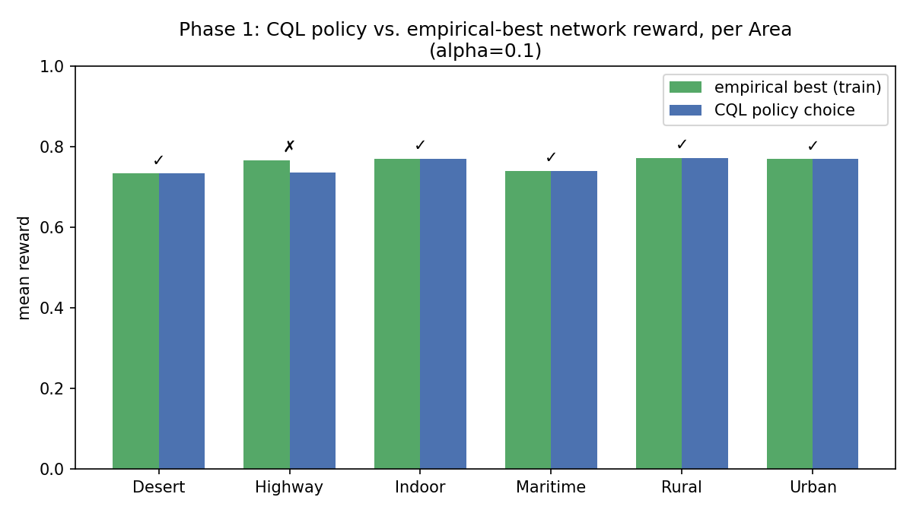
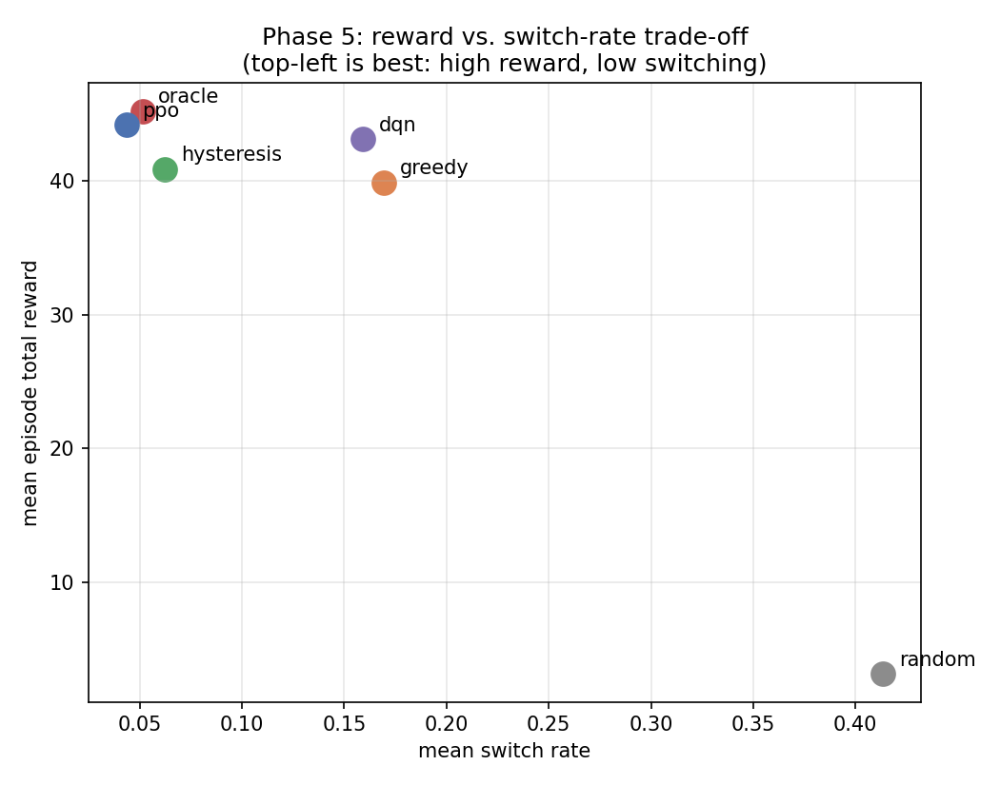
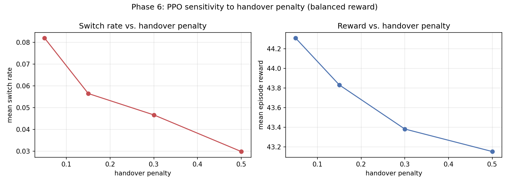
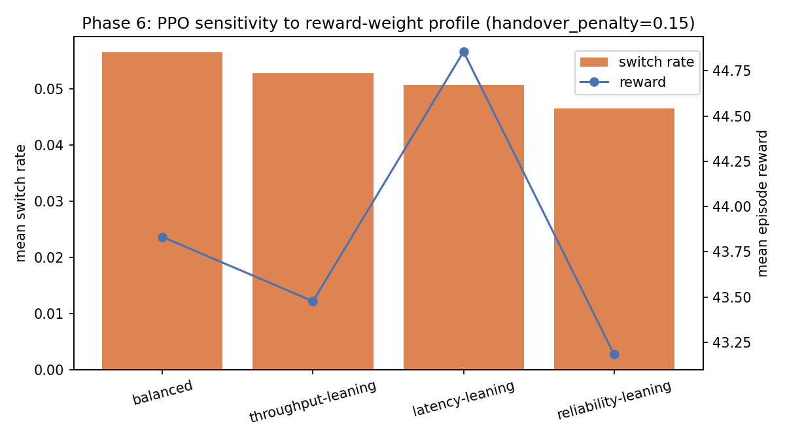

# 1. Introduction and Motivation

A mobile user equipment (UE) operating in a hybrid terrestrial/non-terrestrial network
(TN+NTN) deployment can, depending on its location, connect through several distinct
radio access technologies: terrestrial 5G NR and WiFi 6, and non-terrestrial Low Earth
Orbit (LEO) satellite, High-Altitude Platform Station (HAPS), and UAV relay links.
These options differ sharply in their operating characteristics — terrestrial links
offer low latency over short range, while satellite and HAPS links offer wide coverage
at the cost of substantially higher propagation delay. Selecting the best available
network at each point in time, while avoiding unnecessary switching between networks,
is a sequential decision-making problem well suited to reinforcement learning (RL).

This project began from three existing artifacts: a merged five-network dataset
(*Hybrid\_Network\_TN\_NTN\_Final.csv*), a notebook titled as a "Deep RL Model" that on
inspection contained only exploratory data analysis and no reinforcement-learning code,
and a feature-design specification describing an intended state representation. An
initial review (documented separately) found that no feature extraction, feature
selection, or RL model had in fact been implemented, and that the generated dataset did
not fully match its own design specification (for example, rain-attenuation features
were present for terrestrial 5G rows despite being marked not applicable to that
technology). This report documents the methodology and results of the DRL pipeline
subsequently designed and built: reward formulation, environment design, algorithm
selection, and a systematic evaluation against classical handover algorithms.

# 2. Data and Feature Design

The working dataset, *Hybrid\_Network\_TN\_NTN\_Final.csv*, contains 55,503 rows spanning
five network types (NR_5G, WiFi, SAT (LEO), HAPS, UAV), each row describing a UE's link
conditions and environment for one network at one sampled scenario. A representative
row per network type is shown below.

| Network | Dist. (km) | SNR (dB) | SINR (dB) | Tput (Mbps) | Latency (ms) | Area |
|---|---|---|---|---|---|---|
| NR_5G | 0.151 | 44.54 | 37.44 | 932.9 | 1.12 | Urban |
| WiFi | 0.009 | 60.86 | 58.01 | 0.0 | 1.50 | Indoor |
| SAT (LEO) | 803.6 | 8.57 | 3.47 | 549.0 | 9.36 | Indoor |
| HAPS | 142.4 | 9.11 | 4.31 | 245.4 | 1.15 | Rural |
| UAV | 1.664 | 24.80 | 20.90 | 97.4 | 1.81 | Urban |

A key early finding shaped the state design: the physical-layer KPI columns (distance,
SNR, SINR, throughput, latency, etc.) are entirely determined by *which network a row
represents* rather than by any shared pre-decision context — for example, `distance_km`
never exceeds roughly 1.5 km for NR_5G rows and never falls below roughly 800 km for
SAT (LEO) rows. In the static-dataset setting (Section 4.1), these columns are outcomes
of an implicit choice already made, not information available *before* a network is
selected, and so cannot legitimately form part of the decision-time state without
leaking the answer. Consequently, the Phase 1 state space was restricted to `Area` and
`Available_Networks` only, and `network_type` was treated purely as the action label,
explicitly excluded from the state to prevent label leakage.

This restriction was later relaxed, correctly, once a live simulator was introduced
(Section 4.3): there, live pre-decision *measurements* (received signal strength and
signal-to-interference-plus-noise ratio) for each *candidate* network are legitimately
observable before a handover decision is made — this is what a real UE could measure
by probing neighboring cells prior to switching. Outcome metrics that depend on which
network was ultimately chosen (throughput, latency, packet loss, bit-error rate) remain
reward-only in every phase of this work and are never exposed to the agent as state.

# 3. Reward Design

A composite Quality-of-Experience (QoE) reward was designed to balance three
sub-objectives — throughput, latency, and reliability — rather than optimizing a single
raw metric, which would bias the agent toward degenerate behavior (e.g., a
throughput-only reward would always favor the highest-bandwidth network regardless of
latency, defeating the purpose of having low-latency terrestrial options at all).

$$
R = w_{tp} \cdot \text{tp} + w_{lat} \cdot \text{lat} + w_{rel} \cdot (0.5\,\text{pl} + 0.5\,\text{ber})
$$

All four sub-terms are min-max normalized to $[0,1]$, with higher values always
indicating better outcomes:

- **tp** — log-transformed throughput (`Log_Throughput_Mbps`), not inverted.
- **lat** — log-transformed latency (`log1p(Latency_ms)`), inverted. `Latency_ms`
  already includes propagation delay, so this term alone captures the dominant
  terrestrial-vs-satellite trade-off.
- **pl** — log-transformed packet loss, inverted.
- **ber** — log-transformed bit-error rate (already oriented so that higher is better),
  not inverted.

Normalization bounds are fit on the 1st-99th percentile of each metric (robust to
outliers) and persisted to disk, so the same reward function is applied identically
during training and evaluation. The default weighting is balanced
($w_{tp}=w_{lat}=w_{rel}=1/3$); Section 6.3 reports a sensitivity analysis over
alternative weightings.

# 4. Methodology: Phased Roadmap

The DRL pipeline was developed in six phases, each building on lessons from the
previous one. A mid-project re-evaluation (Section 4.3) led to a substantial redesign
after the initial sequential-RL attempt was found to have a structural flaw.

## 4.1 Phase 1 — Offline Contextual Bandit

Because the state space in the static dataset reduces to only six distinct contexts
(one per `Area`, since `Available_Networks` is a deterministic function of `Area`), and
because every valid action is well represented in the data for its corresponding state,
this was framed as a contextual-bandit problem rather than a sequential one — there is
no handover cost and no temporal coupling between decisions. Discrete Conservative
Q-Learning (CQL) was trained offline directly on the CSV.

## 4.2 Phase 2 — Initial Sequential Attempt (superseded)

To introduce handover cost, a temporal structure was required that the source dataset
did not provide: the five per-technology source files had each been generated by an
independent scenario simulator, so no shared UE trajectory existed across networks. A
shared-mobility model was built on top of the project's existing physics-based channel
simulator to generate a common trajectory from which every candidate network's
conditions could be derived consistently, and a Gymnasium environment was built around
it with a flat handover penalty.

This first environment's observation, however, consisted only of the current `Area`,
`Available_Networks`, and the previously selected network — no live channel
measurements. On review, this was identified as a foundational limitation: such an
agent can only learn a static per-Area lookup table with stickiness, and is structurally
incapable of reacting to instantaneous channel conditions. This does not exercise the
representational advantage of deep RL over a simple lookup table, and undermines the
justification for using RL at all. The environment was consequently redesigned.

## 4.3 Phase 3 — Condition-Aware Environment Redesign

The environment was rebuilt so that, at each decision step, the agent observes — for
every currently available candidate network — its live RSSI and SINR (each
network-normalized), together with the current `Area` (one-hot) and the previously
selected network (one-hot), giving a 26-dimensional observation. These measurements are
computed on-the-fly via the project's physics-based link-simulation chain (thermal
noise through fading to SINR) for every candidate at every step. Outcome metrics
(throughput, latency, packet loss, bit-error rate) are computed only for the network
the agent actually selects, and are used exclusively to compute the reward — preserving
the separation between decision-time information and the consequence of a decision.

The mobility model was also made substantially more realistic:

- **NTN pass geometry.** LEO and HAPS link distance is no longer an unconstrained
  random walk but is derived from an analytic elevation-angle profile that rises,
  peaks, and sets over a bounded visibility window, inverting the simulator's existing
  elevation-angle model. Below a minimum visible elevation the platform is genuinely
  out of view, forcing a real handover rather than a KPI that merely degrades. LEO is
  calibrated with short, cyclic passes (consistent with orbital motion); HAPS is
  calibrated as a persistent regional platform with long, rare-gap visibility windows
  (consistent with station-keeping).
- **Area transitions.** The environment context (`Area`) now evolves within an episode
  via a hand-specified Markov chain rather than being fixed for the whole episode, so
  `Available_Networks` genuinely changes over time within a session.

## 4.4 Phase 4 — Evaluation Harness

A reusable evaluation harness was built supporting many-episode rollout evaluation
(200 episodes per policy configuration by default) with bootstrap 95% confidence
intervals, and multi-seed training, so that reported results reflect a distribution of
outcomes rather than a single run.

## 4.5 Phase 5 — RL Agents versus Classical Baselines

Two RL algorithms — PPO and DQN — were trained (three random seeds each, 100,000
environment steps per seed) on the condition-aware environment and evaluated against
four baselines representative of classical and idealized handover strategies (detailed
in Section 5.4): a random floor, a myopic greedy policy, a 3GPP-style hysteresis policy
with time-to-trigger, and a dynamic-programming oracle providing an approximate upper
bound.

## 4.6 Phase 6 — Reward and Handover-Cost Sensitivity

Two one-dimensional sweeps were run, each retraining PPO from scratch at every point:
handover-penalty magnitude (four values) at the default balanced reward, and
reward-weight profile (four profiles) at the default handover penalty.

# 5. Algorithms

## 5.1 Discrete Conservative Q-Learning (CQL)

CQL is an offline reinforcement-learning algorithm that augments standard Q-learning
with a conservative penalty term that suppresses Q-values for state-action pairs not
well supported by the training data distribution, while maximizing Q-values under the
observed data — mitigating the value overestimation that naive off-policy Q-learning
exhibits when trained from a fixed dataset without further environment interaction.
The conservative-penalty weight ($\alpha$) was tuned from the library default of 1.0
down to 0.1, which was found empirically to fit this problem better: the six-state
action table is small and every valid action is well covered in the data, so the
default conservatism designed to guard against out-of-distribution actions was
unnecessarily suppressing the correct action in several states.

## 5.2 Proximal Policy Optimization (PPO)

PPO is an on-policy actor-critic method that constrains each policy update via a
clipped probability-ratio objective, bounding how far a single update can move the
policy away from the data-collection policy. This trust-region-like constraint gives
PPO a reputation for stable training and comparatively low hyperparameter sensitivity,
and it was selected as the primary sequential-RL algorithm for this problem.

## 5.3 Deep Q-Network (DQN)

DQN is a value-based, off-policy method that learns an action-value function via
bootstrapped temporal-difference updates sampled from a replay buffer, using an
epsilon-greedy behavior policy during data collection. It was included as a
value-based point of comparison against PPO's on-policy, policy-gradient approach.

## 5.4 Baseline Policies

- **Random** — selects uniformly among all actions regardless of availability; a
  zero-knowledge floor.
- **Greedy** — always selects the available network with the highest current SINR; the
  canonical myopic strategy that is expected to ping-pong between near-equal networks.
- **Hysteresis + time-to-trigger** — modeled after 3GPP A3-style handover logic: the
  agent switches away from its current network only if a candidate's SINR exceeds it
  by a fixed margin (0.05, in normalized units) sustained for several consecutive
  steps (3), otherwise it remains on the current network. The current network is
  switched immediately, without hysteresis, if it drops out of availability.
- **Oracle** — a dynamic-programming upper bound. For each evaluation episode, a reward
  matrix is constructed over every (timestep, candidate-network) pair using the same
  deterministic geometry trajectory as the real rollout but an independently drawn
  fading-noise estimate used only for planning; a DP solver then finds the
  reward-maximizing action sequence, including the handover penalty for each switch.
  The resulting plan is then scored by actually executing it in the environment, so the
  realized reward is directly comparable to every other policy evaluated at the same
  seed. The oracle therefore represents "best plan given known geometry and typical
  fading," not a literal replay of the exact realized noise.

# 6. Results

## 6.1 Phase 1 — Offline Bandit

At the tuned conservative-penalty weight ($\alpha=0.1$), the CQL policy matched the
empirical best network in 5 of 6 Areas, compared with only 3 of 6 at the library
default ($\alpha=1.0$), confirming that the default conservatism was over-penalizing
correct actions on this small, fully-covered decision table (Figure 1).

{ width=85% }

## 6.2 Phase 5 — Condition-Aware RL versus Classical Baselines

Table 1 reports mean episode reward (with 95% bootstrap confidence intervals), switch
rate, and outage rate for all six policies, evaluated over 200 episodes per policy
(600 for the multi-seed RL agents).

**Table 1: Phase 5 policy comparison.**

| Policy | Reward (95% CI) | Switch rate | Outage rate |
|---|---|---|---|
| Random | 3.17 [2.08, 4.22] | 0.413 | 0.332 |
| Greedy | 39.88 [39.60, 40.17] | 0.170 | 0.000 |
| Hysteresis | 40.88 [40.59, 41.19] | 0.062 | 0.000 |
| DQN | 43.12 [42.92, 43.33] | 0.159 | 0.000 |
| **PPO** | **44.19 [43.97, 44.42]** | **0.043** | 0.0001 |
| Oracle | 45.20 [44.83, 45.56] | 0.051 | 0.000 |

The headline result is that PPO reaches approximately 98% of the oracle's reward
(a gap of 1.01, or roughly 2%) while achieving the **lowest switch rate of any policy
evaluated, including the hand-tuned hysteresis baseline** (0.043 versus 0.062). PPO
therefore learned an implicit anti-ping-pong behavior purely from the handover-cost
term in the reward signal, without being given any explicit switching rule, and in
doing so outperformed an explicit rule-based algorithm on both axes of the trade-off
simultaneously. DQN clearly outperforms both classical baselines on reward but does not
match PPO's reduction in switch rate (0.159, close to greedy's 0.170) — an honest,
reportable asymmetry between the two RL algorithms rather than a uniform "RL wins on
everything" result. Figure 2 visualizes this trade-off directly.

{ width=80% }

## 6.3 Phase 6 — Reward and Handover-Cost Sensitivity

**Handover-penalty sweep** (Table 2, balanced reward weights): switch rate decreases
monotonically as the handover penalty increases, confirming the mechanism behaves as
designed, at a small and expected cost to raw reward.

**Table 2: Handover-penalty sweep.**

| Handover penalty | Reward | Switch rate |
|---|---|---|
| 0.05 | 44.31 | 0.082 |
| 0.15 | 43.83 | 0.057 |
| 0.30 | 43.38 | 0.047 |
| 0.50 | 43.15 | 0.030 |

**Reward-weight profile sweep** (Table 3, handover penalty fixed at 0.15): a
latency-leaning reward profile clearly outperforms the balanced default on raw reward.
This is consistent with the reward-design observation (Section 3) that latency is the
single KPI most sharply separating terrestrial from non-terrestrial networks, giving
the agent the clearest possible signal to act on when weighted more heavily.

**Table 3: Reward-weight profile sweep.**

| Reward profile | Reward | Switch rate |
|---|---|---|
| Balanced | 43.83 | 0.0565 |
| Throughput-leaning | 43.48 | 0.0528 |
| **Latency-leaning** | **44.86** | 0.0507 |
| Reliability-leaning | 43.18 | 0.0465 |

As a consistency check, the balanced-profile row in Table 3 exactly reproduces the
handover-penalty-0.15 row in Table 2 (43.83, 0.0565) — the same configuration evaluated
independently in both sweeps, confirming reproducibility.

{ width=95% }

{ width=80% }

# 7. Limitations and Future Work

- **Single-UE scope.** The environment models one UE at a time; multi-UE contention
  for shared network resources and inter-UE interference are not modeled.
- **Analytic, not ephemeris-based, NTN geometry.** LEO and HAPS pass profiles are
  generated from an analytic elevation-angle model rather than real orbital ephemeris
  (no two-line-element data), so pass timing and duration are representative rather
  than physically exact for any specific satellite constellation.
- **Unpersisted PPO/DQN training curves.** Unlike the CQL runs, which log per-step
  training diagnostics to disk automatically, the PPO/DQN training curves in this work
  exist only in transient console output and were not persisted as structured data;
  cross-algorithm sample-efficiency comparisons (reward versus training steps) were
  therefore not systematically produced, though final-performance comparisons
  (Section 6.2) were.
- **Low explained variance in PPO's value function.** PPO's critic exhibited low
  explained variance throughout training (approximately 0.01-0.15 across runs),
  indicating the value function did not fit the true return well despite the policy
  itself performing strongly — reported here as an honest limitation rather than
  omitted.
- **DQN's switch-rate asymmetry.** DQN matched or exceeded the classical baselines on
  reward but did not achieve PPO's reduction in switch rate; the cause of this
  asymmetry between the two algorithms was not further investigated in this work.
- **No protocol-layer modeling.** Scheduling, retransmission, and other protocol-layer
  effects are outside the scope of this environment.

Future work could extend this pipeline to multi-UE joint scheduling, incorporate real
ephemeris-based satellite geometry, add protocol-layer simulation, and decompose
reported variance into within-policy (episode-to-episode) and across-seed
(training-to-training) components separately.

# 8. Conclusion

This work took a project with no existing feature-selection or reinforcement-learning
implementation and built a complete pipeline for hybrid TN+NTN network selection: a
composite reward balancing throughput, latency, and reliability; a condition-aware
simulated environment grounded in a physics-based channel model with realistic
satellite/HAPS pass geometry; and a rigorous, multi-seed evaluation against both
classical handover algorithms and a dynamic-programming upper bound. The central
result is that a PPO agent, trained without any explicit handover rule, converges to
within roughly 2% of an oracle upper bound in overall reward while switching networks
less often than a hand-tuned 3GPP-style hysteresis baseline — evidence that the
handover-avoidance behavior emerged from the reward signal itself rather than from
engineered heuristics.
