# Validation Report
Sample size: 40 UEs per technology, 600 steps @ 10ms.

## TN_Data_5G
### Physical invariant checks
- `sinr_le_snr_violations`: 0 (PASS)
- `nan_count`: 0 (PASS)
- `throughput_negative`: 0 (PASS)
- `packet_loss_out_of_range`: 0 (PASS)
- `ber_out_of_range`: 0 (PASS)
- `ber_monotonic_violations`: 1 (CHECK)

### Clean vs. regenerated summary
| column                     |   clean_mean |   noisy_mean |   clean_min |   noisy_min |   clean_max |   noisy_max |
|:---------------------------|-------------:|-------------:|------------:|------------:|------------:|------------:|
| SNR_dB                     |      20.1136 |      23.7862 |       0.185 |    -23.6127 |      45.341 |     48.9021 |
| SINR_dB                    |      14.951  |      19.7868 |      -4.515 |    -27.9092 |      40.241 |     44.2339 |
| BER                        |       0.0078 |       0.0036 |       0     |      0      |       0.1   |      0.4773 |
| Throughput_Mbps            |     387.547  |     404.677  |      32.758 |      0      |    1002.6   |    719.988  |
| Latency_ms                 |       1.2986 |       1.0894 |       1.07  |      1.0004 |       1.53  |      5.493  |
| Packet_Loss_pct            |       3.5975 |       3.7489 |       0     |      0.0002 |      29     |     99.9999 |
| Link_Quality_Index         |      77.8848 |      71.0899 |      19.2   |      0      |     100     |     99.9998 |
| Spectral_Efficiency_bps_hz |       5.1675 |       4.6496 |       0.44  |      0.0023 |      13.37  |      7.2    |
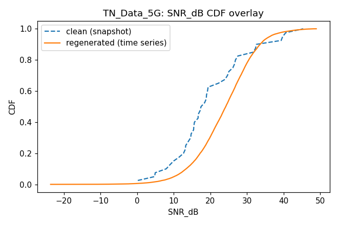
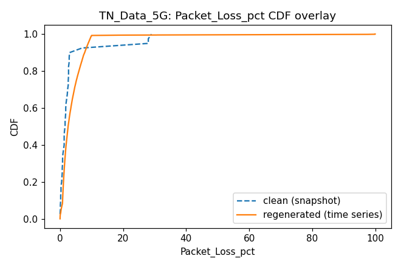
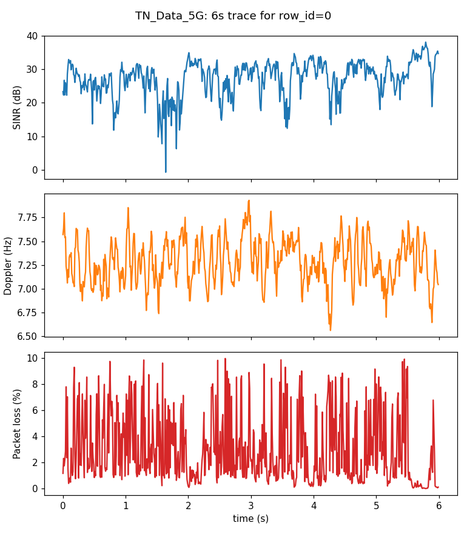
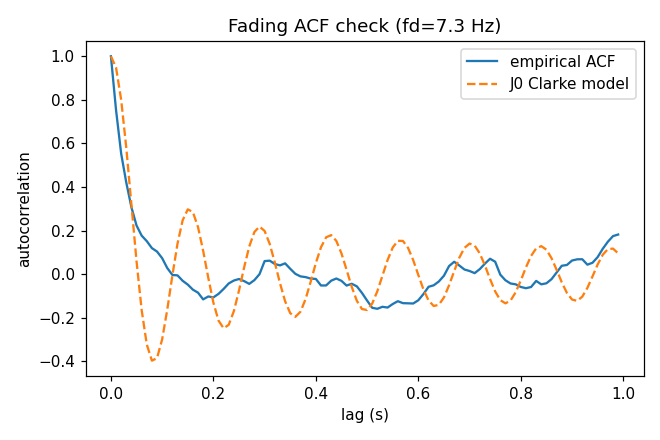
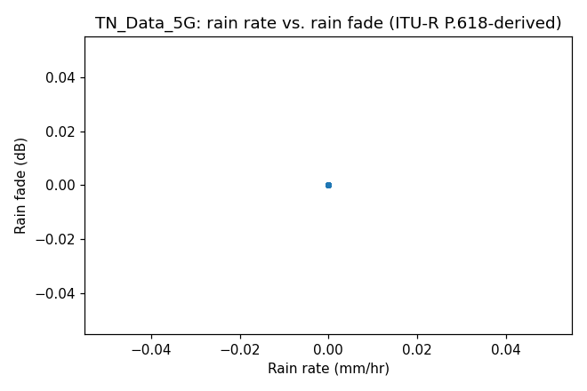

## TN_Data_WIFI_6
### Physical invariant checks
- `sinr_le_snr_violations`: 0 (PASS)
- `nan_count`: 0 (PASS)
- `throughput_negative`: 0 (PASS)
- `packet_loss_out_of_range`: 0 (PASS)
- `ber_out_of_range`: 0 (PASS)
- `ber_monotonic_violations`: 0 (PASS)

### Clean vs. regenerated summary
| column                     |   clean_mean |   noisy_mean |   clean_min |   noisy_min |   clean_max |   noisy_max |
|:---------------------------|-------------:|-------------:|------------:|------------:|------------:|------------:|
| SNR_dB                     |      21.8043 |      29.3853 |     -2.66   |     -3.8248 |     67.97   |     54.5534 |
| SINR_dB                    |      15.6192 |      24.3864 |    -10.1849 |     -8.538  |     59.762  |     49.3999 |
| BER                        |       0.0245 |       0.0002 |      0      |      0      |      0.15   |      0.2983 |
| Throughput_Mbps            |      16.9775 |      22.164  |      5.84   |      0.1083 |     38.66   |     57.698  |
| Latency_ms                 |       1.5211 |       0.4206 |      1.5    |      0.3    |      1.7534 |      3.1    |
| Packet_Loss_pct            |       8.9835 |       7.014  |      0.0493 |      0.0001 |     37.1428 |     81.6791 |
| Link_Quality_Index         |      57.1959 |      78.2897 |     21.1554 |      0      |     82.1248 |     99.9999 |
| Spectral_Efficiency_bps_hz |       5.2548 |       5.6327 |      0.2884 |      0.1891 |     12.279  |      8      |
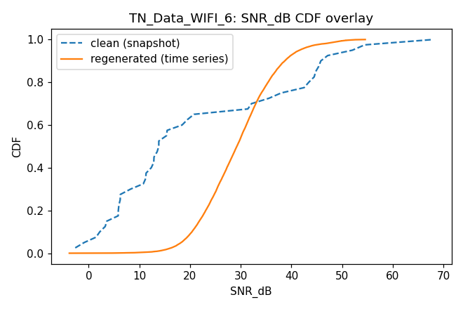
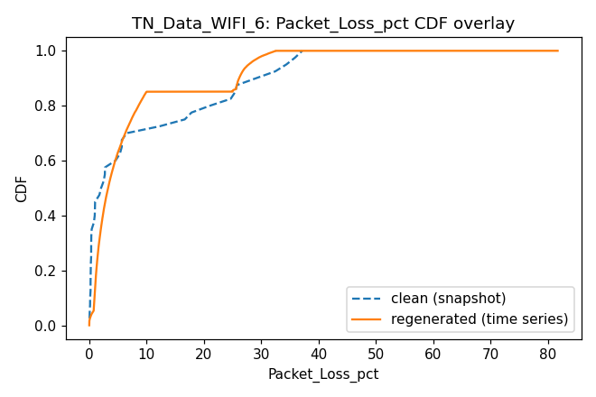
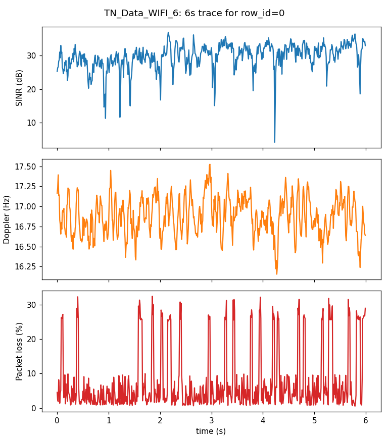
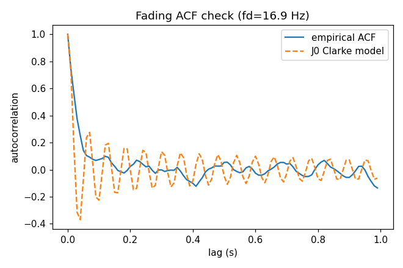

## NTNData_HAPS
### Physical invariant checks
- `sinr_le_snr_violations`: 0 (PASS)
- `nan_count`: 0 (PASS)
- `throughput_negative`: 0 (PASS)
- `packet_loss_out_of_range`: 0 (PASS)
- `ber_out_of_range`: 0 (PASS)
- `ber_monotonic_violations`: 2 (CHECK)

### Clean vs. regenerated summary
| column                     |   clean_mean |   noisy_mean |   clean_min |   noisy_min |   clean_max |   noisy_max |
|:---------------------------|-------------:|-------------:|------------:|------------:|------------:|------------:|
| SNR_dB                     |      16.0905 |      15.4481 |       7.43  |     -2.6195 |     28.53   |     36.4966 |
| SINR_dB                    |      13.113  |      12.4057 |       4.603 |     -5.4923 |     24.704  |     32.0626 |
| BER                        |       0.0002 |       0.0036 |       0     |      0      |      0.0018 |      0.2262 |
| Throughput_Mbps            |     582.037  |      86.8132 |     254.564 |      6.7896 |   1067.49   |    214.412  |
| Latency_ms                 |       1.14   |       2.4177 |       0.367 |      2.0677 |      2.025  |      3.6331 |
| Packet_Loss_pct            |       1.07   |       3.3494 |       0.1   |      0.2032 |      4      |     36.9191 |
| Link_Quality_Index         |      78.8414 |      53.4952 |      51.109 |      0      |    100      |     99.4487 |
| Spectral_Efficiency_bps_hz |       4.4772 |       3.0774 |       1.958 |      0.3588 |      8.211  |      7.2    |
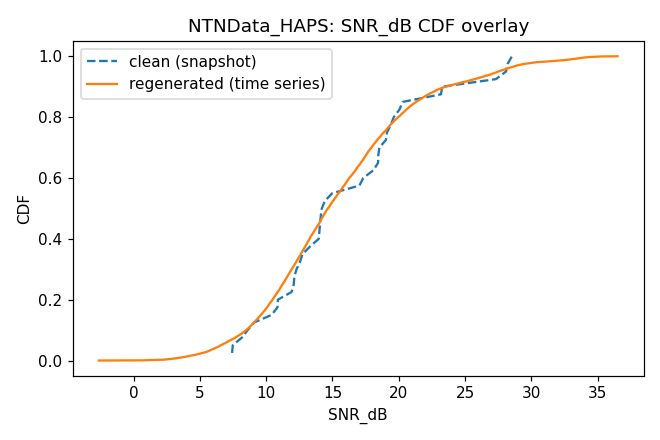
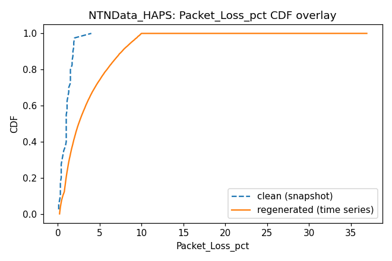
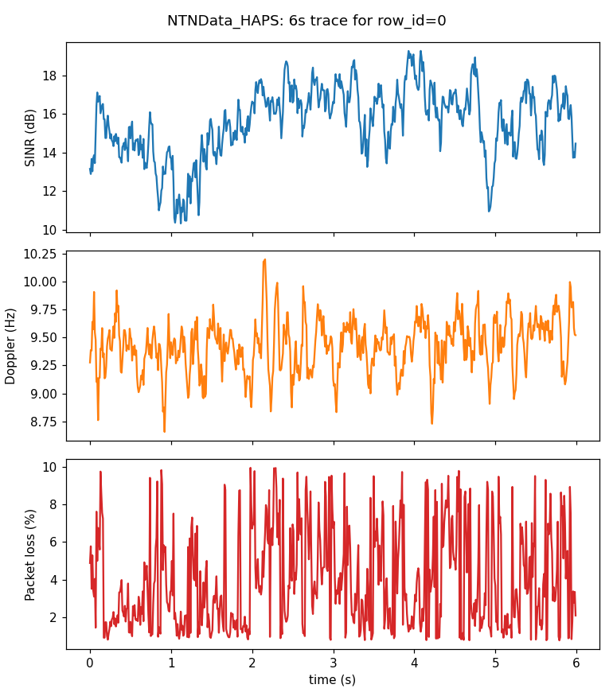
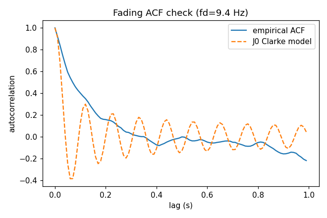

## NTN_Data_LEO
### Physical invariant checks
- `sinr_le_snr_violations`: 0 (PASS)
- `nan_count`: 0 (PASS)
- `throughput_negative`: 0 (PASS)
- `packet_loss_out_of_range`: 0 (PASS)
- `ber_out_of_range`: 0 (PASS)
- `ber_monotonic_violations`: 1 (CHECK)

### Clean vs. regenerated summary
| column                     |   clean_mean |   noisy_mean |   clean_min |   noisy_min |   clean_max |   noisy_max |
|:---------------------------|-------------:|-------------:|------------:|------------:|------------:|------------:|
| SNR_dB                     |       9.3011 |       6.5653 |      6.351  |    -10.2985 |     12.823  |     18.7798 |
| SINR_dB                    |       4.9786 |       4.1382 |      0.582  |    -12.4546 |      8.559  |     13.3516 |
| BER                        |       0.0008 |       0.0335 |      0.0001 |      0      |      0.0018 |      0.368  |
| Throughput_Mbps            |     675.305  |     349.708  |    357.48   |      0.3231 |    985.227  |    855.461  |
| Latency_ms                 |      14.9165 |       6.08   |      5.387  |      4.6757 |     25.956  |     11.3962 |
| Packet_Loss_pct            |       5.215  |       4.3381 |      0.2    |      0.2032 |     14      |    100      |
| Link_Quality_Index         |      52.425  |      32.7171 |     37.04   |      0      |     64.96   |     55.1407 |
| Spectral_Efficiency_bps_hz |       2.0782 |       1.4815 |      1.1    |      0.0797 |      3.03   |      3.6    |
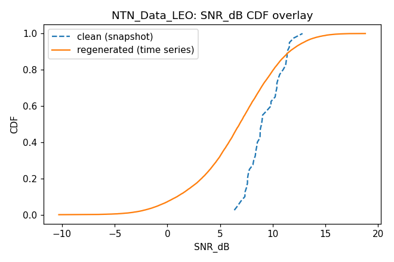
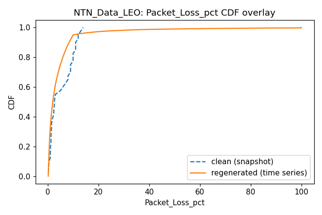
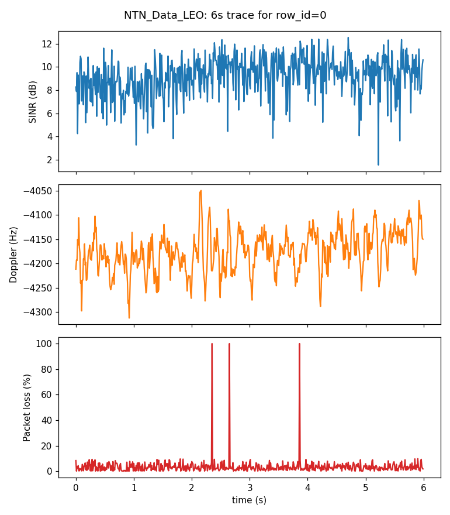
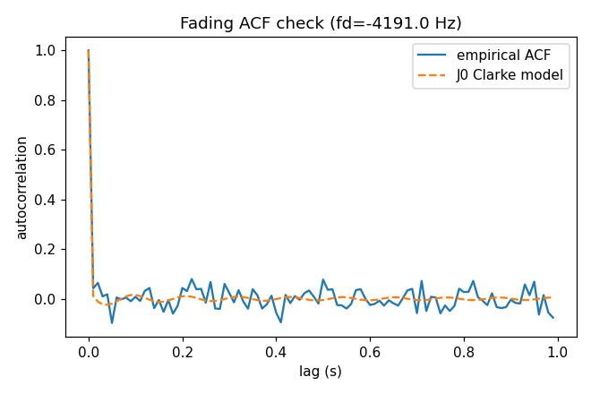
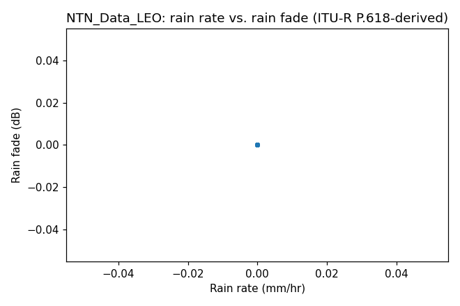

## Data_UAV
### Physical invariant checks
- `sinr_le_snr_violations`: 0 (PASS)
- `nan_count`: 0 (PASS)
- `throughput_negative`: 0 (PASS)
- `packet_loss_out_of_range`: 0 (PASS)
- `ber_out_of_range`: 0 (PASS)
- `ber_monotonic_violations`: 0 (PASS)

### Clean vs. regenerated summary
| column                     |   clean_mean |   noisy_mean |   clean_min |   noisy_min |   clean_max |   noisy_max |
|:---------------------------|-------------:|-------------:|------------:|------------:|------------:|------------:|
| SNR_dB                     |      29.119  |      28.9108 |      20.856 |      5.095  |      50.236 |     53.942  |
| SINR_dB                    |      26.044  |      24.8981 |      16.12  |      1.0476 |      46.836 |     49.0196 |
| BER                        |       0      |       0      |       0     |      0      |       0     |      0.0553 |
| Throughput_Mbps            |     121.224  |     121.558  |      75.455 |     13.3875 |     217.819 |    254.668  |
| Latency_ms                 |       1.508  |       2.0875 |       1.003 |      2.0012 |       1.914 |      2.9446 |
| Packet_Loss_pct            |       1.3475 |       3.1793 |       0.2   |      0      |       3     |      9.9996 |
| Link_Quality_Index         |      99.5908 |      83.0037 |      91.418 |     26.5105 |     100     |    100      |
| Spectral_Efficiency_bps_hz |       8.6588 |       5.6561 |       5.39  |      0.8    |      15.558 |      7.2    |
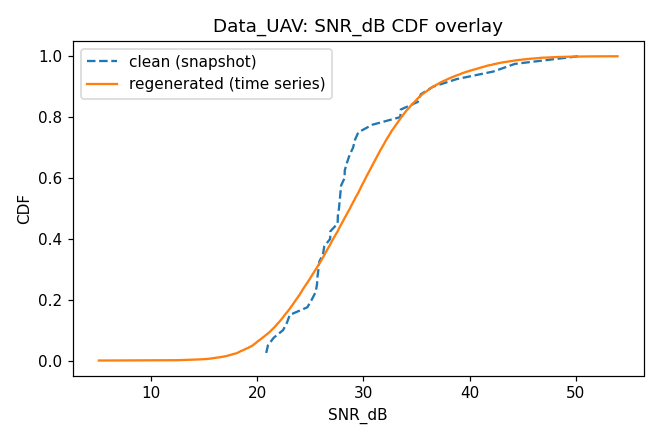
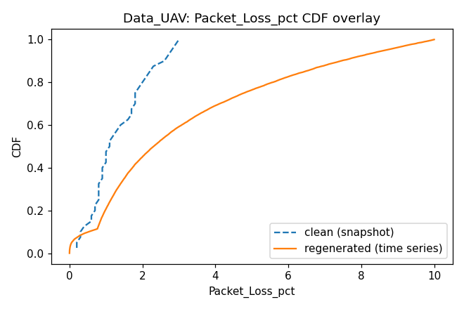
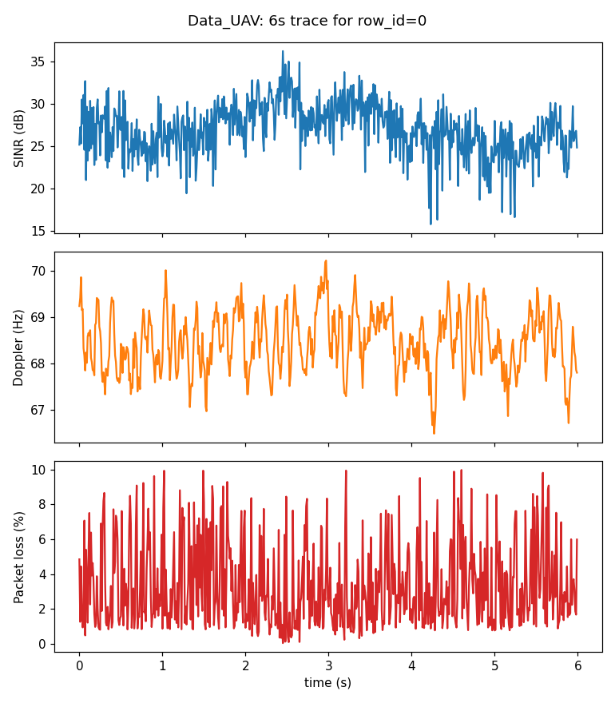
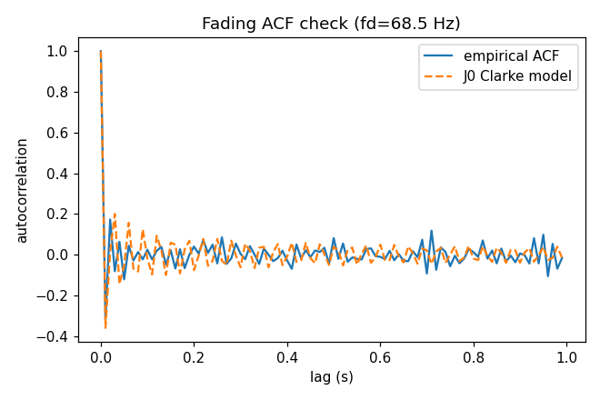
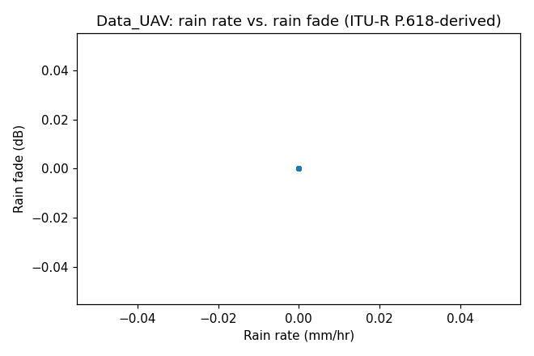
